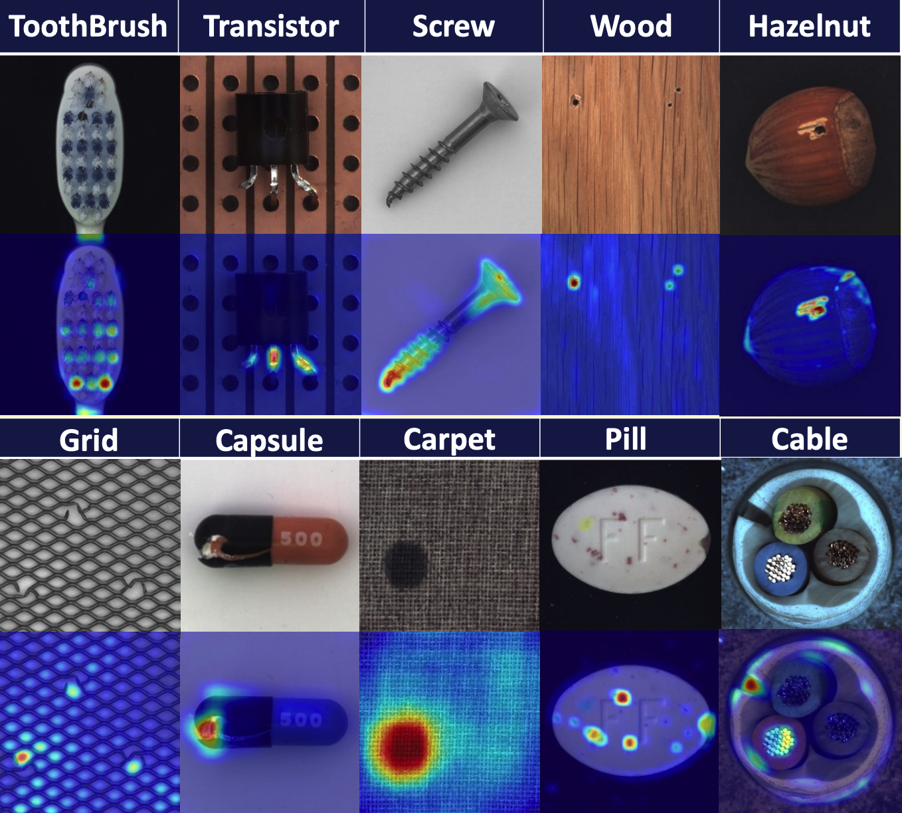

# Interpretable Visual Anomaly Detection 

**by Dongmian Zou, Rui Jiang, Yijia Xue**

*names by the alphabetical order of the last names*

This work is in the paper writing process. 

## Introduction

In recent years, artificial intelligence has been integrated into people’s lives. However, lack of interpretability remains a key obstacle in the application of convolutional neural netwbenorks. Due to the black-box nature of the model, it is difficult for experts to reach an agreement with the model, which results in the limitations of the application scenarios of CNN. Thus, there is significant motivation to investigate the interpretability of CNN. 

In the study, we propose a CNN interpretability model for unsupervised anomaly detection based on important feature visualization to focus on a small but congregating region of an image. The model will be validated on the industrial products image dataset. 

## **METHOD** 

Since our work has not been published, the detailed information will be omitted. The key novelties of our model include applying gradient-based attention during the image reconstruction model training process and localizing the anomalies with the gradient-based attention map. At the training stage, an encoder-decoder-based model Unet was implemented for the image reconstruction task. At the inference stage, the distribution difference between normal samples and reconstructed abnormal samples was calculated to generate the attention map for anomaly detection and localization. 

## Data and Experiments

We conducted extensive experiments on the MV-Tec anomaly detection dataset, corrupted Fashion Mnist and BTAD manufacturing dataset. The experiment process includes applying and testing the performance of various image reconstruction models, different choices of the loss function, and generating attention maps using different layers in encoder architecture. We both quantitatively and qualitatively evaluated the performance of our proposed model. 

Qualitative result: for each category, we show the attention map of one production with defects provided by the MV-Tec dataset. We show, from the top row to the bottom, the original images, and the anomaly attention maps. From below Figure, our generated attention map can precisely localize most anomalies. 



## Code Implenmentation Tutorial

***Dependencies Requirement***

`anaconda` `conda-forge` `defaults` `python=3.9` `pytorch>=1.10.1` `matplotlib>=3.3.3` `python-wget>=3.2`

`python-wget` `tqdm` `cudatoolkit=11.3` `torchvision>=0.11.2` `pandas>=1.2.0` `dipy>=1.3.0` `fury>=0.6.1`

`simpleitk>=2.0.2` `scikit-learn>=0.24.2` `scikit-image>=0.18.3` `ipython>=7.18.1` `tensorboard`

`pip`:

- torchsummary
- timm
- wandb

#### ***Code examples***

#### Step 1. Set the *DATASET_PATH* variable.

Set the  *data_path* to the root path of the downloaded MVTec AD dataset.

#### Step 2. Train **the Model** and Test.

Use the below example ***shell script*** to run the model. You can change the **object class/epoch number/layer number/loss function**

```shell
#!/usr/bin/env python

for((i=1;i<=100;i++));  

do   

python model_path/train_expVAE.py --epochs 50 --one_class 5 --resume ./ckpt/ae_mvtec_checkpoint --layer 'encoder.21' --loss 'mean' --ssim True;  

done 
```


## **REFERENCES** 

Zhou, B., Khosla, A., Lapedriza, A., Oliva, A., & Torralba, A. (2016). Learning deep features for discriminative localization. In *Proceedings of the IEEE conference on computer vision and pattern recognition* (pp. 2921-2929).

Selvaraju, R. R., Cogswell, M., Das, A., Vedantam, R., Parikh, D., & Batra, D. (2017). Grad-cam: Visual explanations from deep networks via gradient-based localization. In *Proceedings of the IEEE international conference on computer vision* (pp. 618-626).